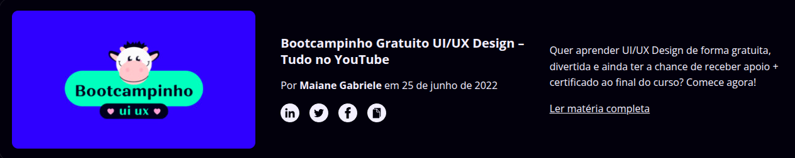

# Bootcampinho | UI e UX

<small>Imagem: Chamada do curso. Créditos: @sheisacreative</small>

Olá dev!

Criei esse projeto para estudar mais sobre UI e UX, seguindo o [bootcampinho](https://sheisacreative.com.br/curso/bootcampinho-ui-ux-design-2), ministrado pela incrível [Maiane Gabriele](https://sheisacreative.com.br/) (@sheisacreative). 💡

Fica aqui meu incentivo a você fazer as aulas e aprender também.

Obs: O pequeno boi que nos passa os desafios é o **Alfred**. 🐮

## Índice

- [AULA 01 - Apresentação do Curso - O que é UI e UX?](docs/01-apresentacao-do-curso.md)
