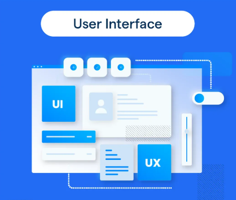
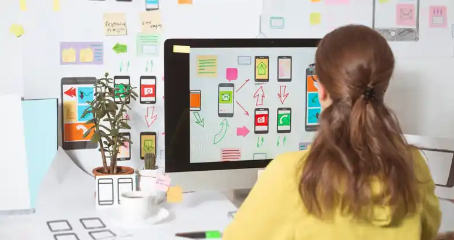

# O que é UI e UX

Essas letrinhas andam sempre de mãos dadas:

- **UI: User Interface** ou **Interface do Usuário**. É o que o usuário vê, seja a tela de aplicativos, sites, painéis, caixas de dialogo, etc.

- **UX: User eXperience** ou **Experiência do usuário**. Representa a interação com a tela de aplicativos, sites, painéis, caixas de dialogo, etc.

## UI - Interface do Usuário

É tudo aquilo que o **usuário vê e interage visualmente** em um sistema, site ou aplicativo.

  
<small>Imagem: User Interface. Créditos: [BotPenguin.](https://botpenguin.com/glossary/user-interface)</small>

A interface inclui elementos como:

- **layouts**
- **espaçamentos**
- **tipografia**
- **cores**
- **ícones**
- **menus**
- **botões**
- **campos de formulário**

A função da **UI** é **tornar a interação clara**, **intuitiva** e **agradável** aos olhos.

Exemplos:

❌ A organização visual confusa de uma página de login — campos desalinhados, texto pequeno e contraste fraco dificultam a leitura e causam má impressão.

✅ Página de login visualmente OK — campos alinhados, texto adequado e contraste bem definido facilitam a leitura e causam boa impressão.

✅ O botão azul de “Enviar” em um formulário.

✅ O layout de um dashboard com gráficos e filtros.

## UX - Experiência do Usuário

É o **conjunto de percepções e sensações que o usuário tem ao interagir** com um produto digital.

  
<small>Imagem: User Interface. Créditos: [And Academy.](https://www.andacademy.com/resources/blog/ui-ux-design/what-is-ux-design/)</small>

A UX considera:

- **usabilidade**
- **acessibilidade**
- **fluxo de navegação**
- **tempo de resposta**
- **clareza das ações**
- o sentimento de **satisfação ao usar**.

Ou seja, **não se trata só do que se vê**, mas de **como é usar**.

Exemplos:

❌ Um app com menus confusos ou lentidão tem má **UX**, mesmo que o design seja bonito.

✅ Um app com menus objetivos e rápidos tem boa **UX**.

✅ Um site que carrega rápido e facilita encontrar informações tem boa **UX**.

✅ O fluxo de compra em um e-commerce, do clique até o pagamento, é parte da **UX**.

## Desafio Alfred 🐮

"Tente identificar nesses projetos quais etapas são mais relacionadas à Interface do Usuários (UI) e quais são relacionadas a Experiência do Usuário (UX)."

- [Brazilian Income Tax System](https://www.behance.net/gallery/131015715/Brazilian-Income-Tax-System-UIUX-Relayout-Proposal)
- [Pollie](https://www.behance.net/gallery/151418227/Pollie)
- [Garaji](https://www.behance.net/gallery/130417419/Garaji)

"Sugestão: para reforçar seu conhecimento, anote suas descobertas."

## Resolução

1. Identificando etapas de UI:

   Os 3 projetos apresentação logo de cara o seu **Design System** ou **Projeto do Sistema**. Aqui temos os elementos elencados acima: botões, ícones, tipografia, cores, espaçamentos, campos de formulário, menus e layouts.

2. Identificando etapas de UI:

   Os 3 projetos explicam como será o fluxo de processo, apresentando os elementos elencados acima: usabilidade, acessibilidade, fluxo de navegação, tempo de resposta, clareza das ações e até o sentimento de satisfação ao usar.

## Conclusão

Ao desenvolver um novo sistema ou evoluir um legado, deve ser levado em consideração a **UI/UX**. Quer gerar valor e melhores resultados para um produto digital? Refine bem a **interface** e crie a **melhor experiência de uso** ao cliente.
