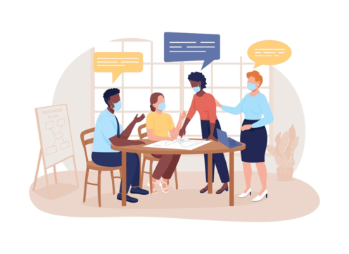

# Começando um projeto

Acredito que todo projeto tem que ter uma etapa de marco zero. As definições são muito importantes antes de qualquer outra fase.

  
<small>Imagem: Coletando e organizando informações. Créditos: [PNG Tree.](https://pngtree.com/free-png-vectors/briefing-team-vector)</small>

Então bora olhar com carinho para a **fundação do projeto**.

## Antes dos antes: o que é design?

> [!NOTE]
>
> **Design** vem do inglês **to design**, que significa “projetar”, “planejar” ou “conceber algo com propósito”.

Design = “projeto com intenção”.

Design não é só aparência, é o planejamento de como algo vai funcionar e ser percebido.

É o processo de criar soluções visuais, funcionais ou estruturais para atender uma necessidade humana ou de negócio.

O design busca equilibrar estética e função.
Ou seja: não basta ser bonito, precisa funcionar bem e comunicar com clareza.

Exemplos:

- Um site pode ter cores lindas (bom design visual), mas se o menu for confuso, o design falhou na função.

- Já um formulário simples e claro, que o usuário preenche sem esforço, é um design eficiente, mesmo sem muitos enfeites.

## O que fazer antes do Design?

A primeira coisa mais importante é **ter uma noção de fato do que será feito**. Algumas noções básicas:

- Tamanho do projeto.
- Qual será o escopo do que vai ser feito (com flexilidade pra alterações).
- Prazos para entregas.

Por convenção, criamos um documento chamado de **Briefing** para organizar essas informações.

> [!NOTE]
>
> 📑 Briefing é um documento (ou reunião) que reúne as informações essenciais para iniciar um projeto. Seja de design, desenvolvimento, marketing, ou qualquer outro tipo.

O termo vem do inglês **brief**, que significa **“resumo”**.
Um **briefing** é literalmente um resumo das necessidades e objetivos do projeto.

Podemos considerar como o ponto de partida que orienta:

- O que será feito.
- Por que será feito.
- Para quem será feito.
- E com quais recursos será feito.

## Quem é o cliente?

Pode ser uma empresa ou alguém dentro do seu trabalho solicitando um projeto. Tente entender o máximo possível sobre o cliente, veja seu perfil (apressado, confuso, racional, organizado, etc...).

Solicite a ele o material da marca (se disponível).

Peça referências do que o cliente gosta, inspirações de benchmark e quem são seus potenciais concorrentes.

E que tal um questionário pra ajudar nesse "pente fino", ajudando a entender o universo desse cliente:

- A marca usa mais curvas ou retas?
- Quais são as cores da marca?
- É uma marca que parece mais jovem ou mais tradicional?
- Quais são as referências e qual sua expectativa?
- Tem algum material que você achou legal e quer recomendar?

## Atenda o objetivo

O ponto principal aqui: **atender o objetivo do cliente** 🎯.

Não adianta nada criar um design na régua, com perfeição na estrutura se ele não atende ao contexto do que foi pedido.

Sabe quando você vai cortar o cabelo, **pede um corte degradê** e o barbeiro **apenas passa a maquininha 180º?** Bem, é complicado cara. Hahaha.

Tente escrever em uma linha a frase do que será feito. Isso servirá pra validar e aprovar para ir aos próximos passos.

> Exemplo: Desenvolver um novo catálogo de produtos limpo e enxuto.

O Design nunca é um projeto estático. Nada é escrito em pedra, as coisas vão mudando, porém quanto melhor o alinhamento, mais o processo seguirá num fluxo adequado, evitando retrabalhos e desgaste.

A expectativa tem que estar sempre alinhada.

## Qual o tamanho do projeto

É muito fácil do projeto começar com algo bem simples e se tornar um monstro gigantesco se não houver a **restrição bem clara no escopo**.

Exemplo:

> Exemplo: "Eu preciso de um site simples, apenas uma página." — Disse o Cliente. 😄

Poucas semanas depois... site possui diversas páginas, validações, tema claro e escuro (tudo com orçamento estourado e algumas coisas não tão bem acabadas por falta de recursos).

Nunca é um problema o projeto aumentar. É algo bom, pois está sendo atendido o propósito. A grande questão é sempre o alinhamento de ambas as partes, pra que todos tenham ciência dos custos, prazos e recursos que precisam ser dimensionados para atender plenamente as entregas.

Uma métrica interessante de preço seria a cobrança por telas, por páginas, artes. Isso gera noção de entrega e valor.

## Definição de Prazos

Conforme a expectativa de prazos, alinhamos o que é possível fazer com as datas determinadas. Evite deixar virar bagunça.

## Responsável pela aprovação

As vezes, quem solicitou o projeto pode não ter alçada ou a última palavra pra fechar o projeto. Por isso é importante ter a definição de quem será o decisor. Somente com o aceite do decisor é que o projeto pode iniciar e avançar a cada etapa, conforme hajam alterações ou necessidade de novas aprovações.

## Desafio do Alfred 🐮

Projeto: Escolha um projeto para fazer durante o curso (tema livre).

Sugestão: evite utilizar as ideias desta página. Aproveite para exercitar a criatividade. Na dúvida, lembre de todos os momentos em que você passa um raivinha tentando fazer algo rs… (talvez seja um bom problema para resolver).

## Resolução

Projeto escolhido: Catálogo digital de produtos em PDF, com navegação por links.

Fugindo um pouquinho dos padrões de sites e apps, o cliente precisa de ajuda para divulgar seus produtos em um catálogo digital. Pensando nos clientes do cliente, o meio mais simples é a divulgação de um documento PDF, disponível no site.

Atendo ao objetivo criando algo mais clean e enxuto, guiando o olhar do cliente, proporcionando a melhor experiência ao pesquisar por uma peça, servindo como um pipeline de vendas.

## Conclusão

Assim com UI e UX andam sempre juntos, **Projetos** e **Processos** devem fazer o mesmo. O projeto é algo que tem início, meio e fim. O processo é o ciclo continuo, que se mantém funcionando após o término do projeto.

Ter tudo bem definido e alinhado, aproxima a **expectativa da realidade**. Isso é fundamental em questão do que **foi idealizado ao que será entregue**.
